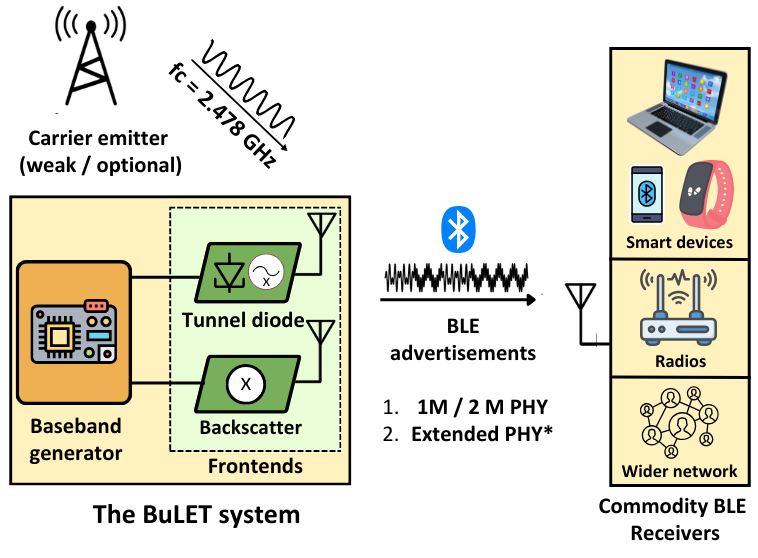
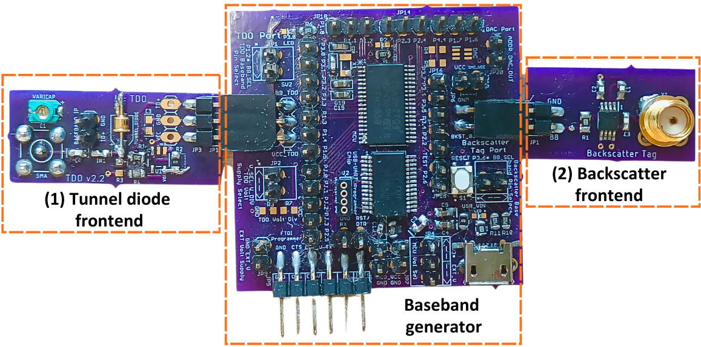
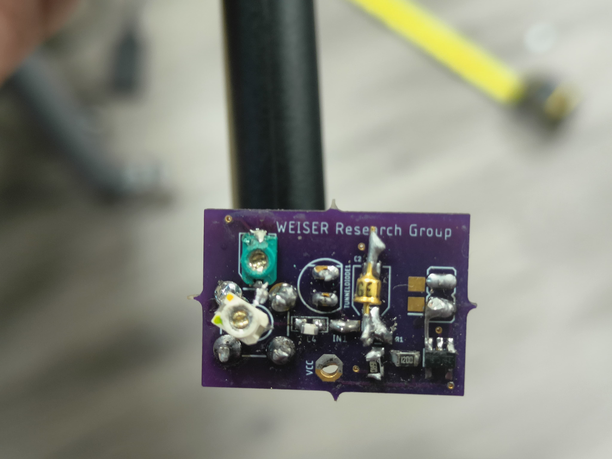
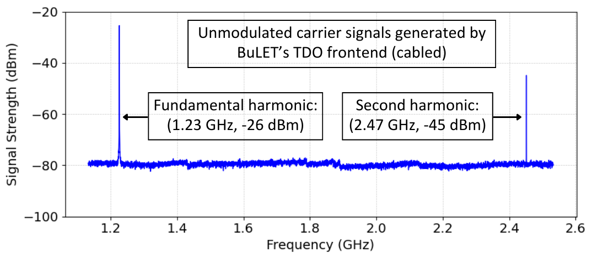
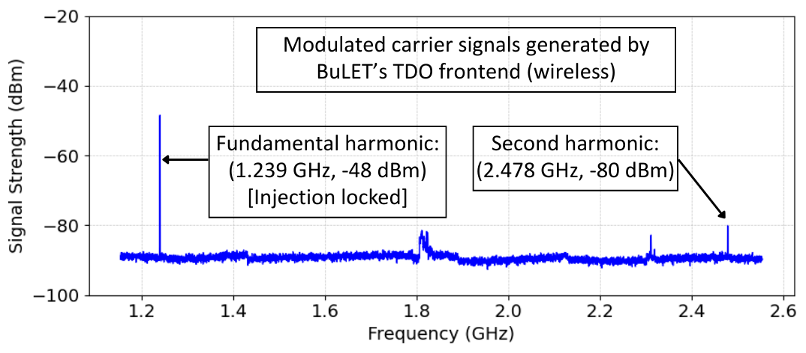
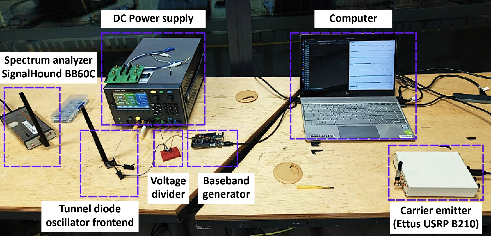
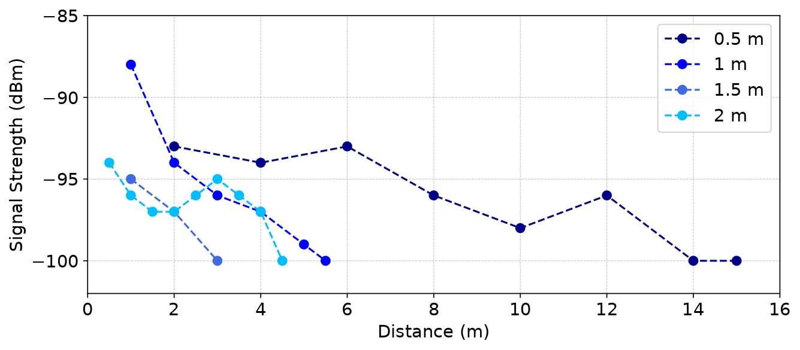
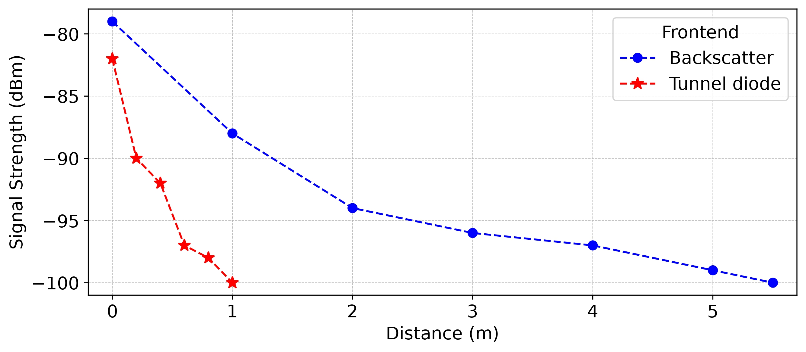
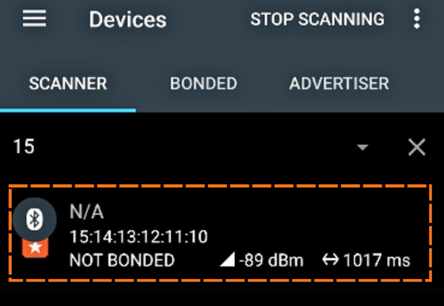

# BuLET: An Ultra Low Energy Transmitter

This repository contains the code and artifacts for **BuLet** which is developed as a part of CS5272: Embedded Software Design Course Project, Spring 2025 held at NUS.

> The BuLET system aims to enable low-power BLE
advertisement transmissions in the 1M / 2M PHY modes with
the provision of Extended PHY later. These transmissions are
decodable by commodity BLE receivers like smartphones:




## Abstract

Increased embedded system deployments have driven the widespread adoption of various wireless standards. Commonly used protocols include Wi-Fi, Bluetooth, ZigBee, and LoRa operate in the Industrial, Scientific and Medical bands (ISM) i.e. 868 MHz and 2.4 GHz showing their ubiquity and allowance for unlicensed transmissions. Despite advancements in low-power sensors and microcontrollers, the wireless radio subsystem—particularly its analog front end—remains a major power bottleneck in embedded IoT devices. Classic Bluetooth and Bluetooth Low Energy (BLE) dominate short-range wireless communication in the 2.4 GHz spectrum, with BLE favored for its energy efficiency in lightweight, battery-powered applications. However, even state-of-the-art BLE transmitters typically consume around 20 mW  to hundreds to milliwatts, limiting lifetime for battery-operated devices. Existing low-power solutions, such as BLE backscatter, decrease transmission power but rely on external emitters to generate carrier signals, which incurs additional energy costs. Tunnel diode oscillators present another option for generating radio signals with power consumption below 100 µW but face stability issues. In this work, we introduce BuLET, an ultra-low-power Bluetooth transmitter that integrate both backscatter and tunnel diode oscillator (TDO)-based frontends with a commercial microcontroller to generate BLE-compliant advertisements for unidirectional communication. We also demonstrate sub-harmonic injection locking to stabilize the TDO for reliable communication.

## Contributions

1.  BuLET is a compact (10cm x 5cm) system built using off-the-shelf components. It houses a low-power microcontroller for baseband generation and processing combining both **tunnel diode** based and **backscatter** frontends. This enables energy-efficient unidirectional BLE advertisments}= for sustainable communication.
2. Extending on Judo architecture, BuLET stabilizes the TDO from resonant frequency shifts by injection-locking lower-frequency sub-harmonic of TDO at **1.239 GHz** (**sub-harmonic injection locking**, min strength = 50 dBm). This supports the argument that lower-frequency signals are easier to generate from commodity devices. 
3. BuLET has a total power consumption of under **250 µW** which includes the baseband generator and frontends.
4. BuLET's transmissions are compatible to be received by commodity BLE receivers like smartphones and tablets.

## Repository Organization

```
├── LICENSE
├── README.md
├── assets                     # pictures, plots and images
│   ├── backscatter_frontend
│   ├── baseband_generator
│   └── tdo_frontend
├── data_logs                  # spectrum analyzer data
│   ├── cabled_spectrum
│   └── wireless_spectrum
├── examples
├── firmware                   # firmware implementations for BLE baseband
│   ├── beaglebone             # (1) beaglebone black implementation using PRU
│   └── ble_baseband_5969      # (2) msp430 implementation 
└── hardware                   # hardware PCB design files for BuLET designed in eagle
    ├── README.md             
    ├── backscatter_frontend
    ├── baseband_generator
    └── tdo_frontend
```

## Hardware Design

### Platform and Baseband Generator

The hardware platform prototype of the BuLET
system consists of a baseband generator and both backscatter
and tunnel diode based frontends to support low-power BLE
transmissions.



### Tunnel Diode Oscillator Frontend

A tunnel diode oscillator built using a 1N3712 tunnel diode and passive RLC components. It oscillates at the following frequencies measured in a cabled setup.
- Principal frequency = 1.23 GHz, -26 dBm
- Second harmonic frequency = 2.47 GHz, -45 dBm



Spectrum of unmodulated carrier signals generated by TDO captured in a cabled setup.



Spectrum of the modulated / mixed signal after sub-harmonic injection locking captured in a wireless setup. The carrier signals generated by TDO, after mixing with the BLE baseband signal represents the mixed signal. The lower-order or principal harmonic at 1.23 GHz is injection locked, which also stabilizes the second harmonic at 2.47 GHz. Minimum injection locking strength is reported to be as -50 dBm.



# Evaluation

### Evaluation Setup



### Backscatter Frontend

Signal strength of the BLE advertisements (mixed signal) recorded on a spectrum analyzer at various distances in a LoS setting with changing distances between the carrier emitter and the tag: 0.5 m, 1 m, 1.5 m, 2 m.



### Performance Comparison of Frontends

TDO frontend achieves a minimal range of 1 m as compared to 5.5 m by backscatter when the carrier emitter / injection locking device are kept each 1.5 m away from the tag. This is due to the weak carrier signal generated by TDO and even weaker mixed signal at 2.478 GHz (39th Advertisement channel).



### Reception

Successful reception of BuLET generated BLE advertisements from either frontends on a capable commodity smartphone.




### Power consumption 

Comparison of power consumption and lifetime of BuLET with different wireless technologies on a 225 mAh CR2032 battery.

| **Technology**                  | **Power Consumption** | **Lifetime (225 mAh battery)** |
|:---------------------------------|:----------------------:|:------------------------------:|
| **Active Classic Bluetooth TX**  | 0.5 - 1 W              | 40 minutes                    |
| **Active BLE TX**                | 20 - 100 mW            | 15 hours                      |
| **BuLET Backscatter TX**         | 150 μW                  | 80 - 100 days                |
| **BuLET Tunnel diode TX**        | 250 μW                  | 50 - 80 days                 |


## Limitations

- Early prototype of a low-power BLE transmitter using tunnel diode oscillators (TDO) and sub-harmonic injection locking.
- Current TDO is unable to:
  - Generate stronger signal strength at the second harmonic. OR
  - Build a TDO operating with principal harmonic at 2.478 GHz.
- These limitations affect system performance and the ability to use weaker injection locking signals.
- Achieving this would establish significant novelty over existing backscatter systems.

## Future Work
- Build a 2.4 GHz TDO with a strong principal harmonic.
- Enable various BLE modes, including:
  - LE Coded PHY (Long Range Mode).
  - Frequency hopping on simple systems like BuLET.

## Acknowledgements

This project is completed and submitted to fulfill the requirements of CS5272: Embedded Software Design course at NUS (Spring 2025). I acknowledge and thank Prof. Ambuj Varshney for his support and guidance throughout this course.